# 🚀 PIXO — First MVP Android AI Photo Editor

<p align="center">
  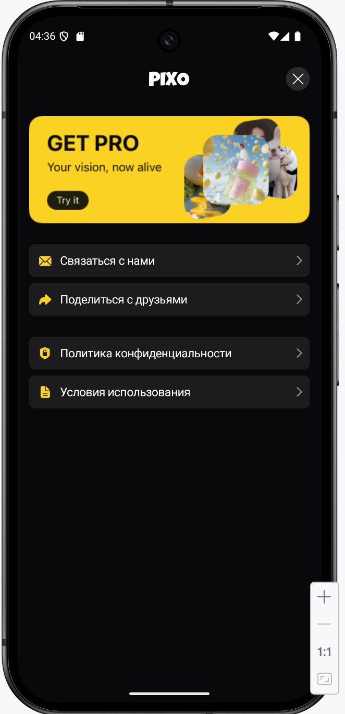
</p>

<p align="center">


</p>

---

# 📌 Project Overview

| 🚀 Product      | 📱 Platform      | 🧠 Type        | 🏢 Requested By | ⏳ Requested Timeline | 📊 My Estimate     | ✅ Final Timeline      | 🎯 Result              |
| --------------- | ---------------- | -------------- | --------------- | -------------------- | ------------------ | --------------------- | ---------------------- |
| PIXO            | Android          | First MVP      | Broad Apps      | 2–3 days             | 14–17 days         | 22 days               | Fully implemented MVP  |
| AI Photo Editor | Kotlin + Compose | AI Editing App | Mobile Product  | Fast-delivery MVP    | Realistic estimate | Full production cycle | Large-scale mobile MVP |

---

# 🧩 MVP Scale

| 🧱 Tool Blocks   | 🖥 Tool Screens    | 🎨 Templates | 🧾 Template Screens      | ✍️ Prompt Screens    | 🕘 History Screens | ⚙️ Settings Screens | 💳 Paywall Screens               |
| ---------------- | ------------------ | ------------ | ------------------------ | -------------------- | ------------------ | ------------------- | -------------------------------- |
| 11               | 170+               | 24 cards     | 15 repeated-flow screens | 10                   | 4                  | 2                   | 2 + 3 onboarding paywall screens |
| Individual flows | 15–18 screens each | Grid system  | Shared editor flow       | Separate prompt flow | Interactive states | Settings actions    | Premium onboarding               |

---

# ⚙️ Development Scope

| 📋 Steps                    | 🧠 Tasks             | 🏗 Stages               | 📱 Total Screens         | 🔄 App Flows                        | 🎨 UI Components                    | 🧩 Tool Variants               | 🚀 MVP Type             |
| --------------------------- | -------------------- | ----------------------- | ------------------------ | ----------------------------------- | ----------------------------------- | ------------------------------ | ----------------------- |
| 73                          | 203+                 | 33                      | 170+                     | Multiple onboarding + premium flows | Slider system + reusable Compose UI | 11 separate AI tools           | First large Android MVP |
| Step-by-step implementation | Detailed feature map | Structured architecture | Production-like UI scale | Free/Premium logic                  | Dynamic editor screens              | Different feature combinations | Real-world MVP scope    |

---

# 🛠 Technology Stack

| Kotlin        | Jetpack Compose | Navigation            | Koin                 | Room           | DataStore   | Coil          | Coroutines       |
| ------------- | --------------- | --------------------- | -------------------- | -------------- | ----------- | ------------- | ---------------- |
| Main language | UI rendering    | Multi-flow navigation | Dependency Injection | Local database | Local state | Image loading | Async operations |

| Adapty              | FileProvider           | MediaStore            | MVVM             | Clean Structure  | Permission Manager  | Mock Backend  | Localization |
| ------------------- | ---------------------- | --------------------- | ---------------- | ---------------- | ------------------- | ------------- | ------------ |
| Subscription system | Camera + share support | Save generated images | State management | Layer separation | Runtime permissions | AI simulation | EN / RU      |

---

# 🧭 Main Navigation

| 🏠 Tools         | 🎨 Templates       | ✍️ Prompt      | 🕘 History          | ⚙️ Settings      | 💎 Get PRO       | 🪙 Token Balance | 🚪 Paywall     |
| ---------------- | ------------------ | -------------- | ------------------- | ---------------- | ---------------- | ---------------- | -------------- |
| 11 cards         | 24 cards           | Prompt flow    | 4 states            | Actions/settings | Free users       | Yearly users     | Premium route  |
| AI editing tools | Template generator | Prompt + image | Interactive loading | Upgrade/contact  | Opens onboarding | Replaces Get PRO | Locked premium |

---

# 🔐 Subscription Flow

| 👤 User State       | 🚀 First Launch      | 🔄 Second Launch     | 🧩 Tools Click  | 🎨 Templates Click  | ✍️ Prompt Click   | 🕘 History Click    | 💎 Top Button  |
| ------------------- | -------------------- | -------------------- | --------------- | ------------------- | ----------------- | ------------------- | -------------- |
| No subscription     | Full onboarding flow | Paywall after 10 sec | Tool onboarding | Template onboarding | Prompt onboarding | Interactive loading | Get PRO        |
| Weekly subscription | Opens main app       | Opens Tools          | Opens tool flow | Opens template flow | Opens prompt flow | Opens history       | Premium access |
| Yearly subscription | Opens main app       | Opens Tools          | Opens tool flow | Opens template flow | Opens prompt flow | Opens history       | Token balance  |

---

# 🎬 First Launch Flow

| 1️⃣ Step                    | 2️⃣ Step             | 3️⃣ Step           | 4️⃣ Step                    | 5️⃣ Step              | 6️⃣ Step           | 7️⃣ Step       | 8️⃣ Step              |
| --------------------------- | -------------------- | ------------------ | --------------------------- | --------------------- | ------------------ | -------------- | --------------------- |
| 11 Tools onboarding screens | Templates onboarding | Prompt onboarding  | Join Happy Users onboarding | Interactive screen    | Paywall onboarding | Paywall screen | Main locked state     |
| Premium education           | Feature explanation  | Prompt explanation | Social proof                | Interactive animation | Subscription intro | Purchase flow  | Free-user restriction |

---

# 🎬 Detailed Onboarding Flow

| 🚀 Flow | 📖 Description | 🔗 Open |
|---|---|---|
| Full onboarding system | Splash → 11 onboarding screens → Templates → Prompt → Rate flow → Interactive flow → Paywall | [Open Detailed Flow](docs/onboarding/README.md) |

---

# 🔄 Returning Free User Flow

| ⏱ Trigger              | 🏠 Tools             | 🎨 Templates             | ✍️ Prompt              | 🕘 History                | ⚙️ Settings         | 💎 Get PRO       | 🧠 Result          |
| ---------------------- | -------------------- | ------------------------ | ---------------------- | ------------------------- | ------------------- | ---------------- | ------------------ |
| App opened second time | Opens main tabs      | Opens onboarding         | Opens onboarding       | Shows interactive loading | Opens premium route | Opens onboarding | Returns to Paywall |
| Paywall after 10 sec   | Tool onboarding flow | Template onboarding flow | Prompt onboarding flow | 4-image loading demo      | Premium actions     | Interactive flow | Subscription gate  |

---

# 🧠 Tool Types

| AI Enhancer   | Glam Makeup   | Remove Objects   | Remove Background   | Skin Improve   | Upscale Image   | Change Scene   | Hair Studio   |
| ------------- | ------------- | ---------------- | ------------------- | -------------- | --------------- | -------------- | ------------- |
| `AI_ENHANCER` | `GLAM_MAKEUP` | `REMOVE_OBJECTS` | `REMOVE_BACKGROUND` | `SKIN_IMPROVE` | `UPSCALE_IMAGE` | `CHANGE_SCENE` | `HAIR_STUDIO` |

| Smile Edit   | Ghostface   | Ghibli   | Prompt Flow   | Templates Flow | Premium Onboarding    | Generate Flow | Result Flow        |
| ------------ | ----------- | -------- | ------------- | -------------- | --------------------- | ------------- | ------------------ |
| `SMILE_EDIT` | `GHOSTFACE` | `GHIBLI` | Separate flow | Separate flow  | Individual onboarding | AI generation | Save/share/history |

---

# 🧰 Tools Screen System

| 🧩 Tool Cards        | 🖼 Card Slider | 📱 Open Screen     | 🖼 Full Slider     | ⚙️ Unique Features         | 🔄 Shared Flow       | 📸 Photo Flow     | 🧠 AI Result  |
| -------------------- | -------------- | ------------------ | ------------------ | -------------------------- | -------------------- | ----------------- | ------------- |
| 11 cards             | Before / After | Separate screen    | Before / After     | Different controls         | Shared architecture  | Camera / Gallery  | Generation    |
| Interactive previews | 2-photo slider | 15–18 screens each | 2-photo comparison | Different options per tool | Common editor system | Requirements flow | Result screen |

---

# 🖼 Before / After Slider System

| 📍 Location  | 🎯 Purpose     | 🖼 Variant 1      | 🖼 Variant 2                    | 📱 Usage         | 🧩 Tool Count | ⚡ Interaction       | ✅ Status |
| ------------ | -------------- | ----------------- | ------------------------------- | ---------------- | ------------- | ------------------- | -------- |
| Tool cards   | Preview effect | 2 separate photos | 1 image container with 2 states | Card preview     | 11            | Swipe slider        | Done     |
| Open screens | Show AI result | 2 separate photos | 1 image container with 2 states | Full interaction | 11            | Interactive compare | Done     |

---

# 🎨 Templates

| Gloria Model  | Cherry         | Travel Style | One Love | Warm Day     | Pink Captivity | 80s Gloss        | Match Point    |
| ------------- | -------------- | ------------ | -------- | ------------ | -------------- | ---------------- | -------------- |
| Japan Breathe | Easter Morning | Sea Breathe  | Blossom  | Darning Noir | Love in Paris  | Queen of the Day | Old Money Muse |

| Sport & Healthy   | Rapunzel Glow       | Safari       | Housewives    | Morning Routine | Oscar       | Retro Style | Metro Style     |
| ----------------- | ------------------- | ------------ | ------------- | --------------- | ----------- | ----------- | --------------- |
| 24 template cards | AI style generation | Premium flow | Shared editor | Camera/gallery  | Result flow | Save/share  | History support |

---

# ✍️ Prompt Flow

| ✍️ Prompt Input | 📸 Attach Photo | ⚠️ Validation             | 🚀 Generate       | 💎 Premium Check      | 🪙 Token Check           | 🎬 Prompt Onboarding     | 📱 Screens             |
| --------------- | --------------- | ------------------------- | ----------------- | --------------------- | ------------------------ | ------------------------ | ---------------------- |
| Required        | Required        | Disabled if empty         | AI generation     | Required              | Required                 | Separate onboarding flow | 10                     |
| Text + image    | Gallery/camera  | Prompt + image validation | Result generation | Free-user restriction | Token balance validation | Premium education        | Separate prompt states |

---

# 🕘 History System

| 📭 Empty       | ⏳ Loading              | ✅ Success        | ❌ Error        | 🖼 Interactive Loading | 📸 Example Images | 🔁 Retry         | 🗑 Delete             |
| -------------- | ---------------------- | ---------------- | -------------- | ---------------------- | ----------------- | ---------------- | --------------------- |
| No generations | Generation in progress | Completed result | Failed state   | 4-image loading demo   | AI examples       | Retry generation | Delete item           |
| Empty UI       | Loader state           | Result cards     | Error handling | Interactive preview    | Preview states    | Recovery flow    | Local history cleanup |

---

# ⚙️ Settings System

| 💎 Upgrade      | 📩 Contact    | 📤 Share     | 🔐 Privacy Policy | 📜 Terms of Use | ⭐ Rate App    | 🪙 Token State | 👤 Premium State |
| --------------- | ------------- | ------------ | ----------------- | --------------- | ------------- | -------------- | ---------------- |
| Opens paywall   | Email support | System share | Browser link      | Browser link    | Store review  | Yearly balance | Access state     |
| Premium upgrade | Support route | Invite users | Legal route       | Legal route     | In-app review | Token amount   | Get PRO hidden   |

---

# 💳 Monetization System

| 💎 Paywall        | 🎬 Paywall Onboarding | 🪙 Token Screen | 📅 Weekly Plan | 📆 Yearly Plan | ♻️ Restore        | 🧪 Sandbox Tests | 🔒 Premium Gate        |
| ----------------- | --------------------- | --------------- | -------------- | -------------- | ----------------- | ---------------- | ---------------------- |
| 2 screens         | 3 onboarding screens  | 1 screen        | Enabled        | Enabled        | Supported         | Tested           | Multiple app flows     |
| Subscription flow | User education        | Token balance   | Weekly premium | Yearly premium | Restore purchases | Adapty testing   | Free-user restrictions |

---

# 📱 Screen Count Overview

| 🧩 Tools           | 📱 Tool Screens             | 🎨 Templates           | ✍️ Prompt         | 🕘 History          | ⚙️ Settings     | 💳 Paywall         | 🪙 Token      |
| ------------------ | --------------------------- | ---------------------- | ----------------- | ------------------- | --------------- | ------------------ | ------------- |
| 11 blocks          | 170+                        | 24 cards               | 10 screens        | 4 screens           | 2 screens       | 2 + 3 onboarding   | 1 screen      |
| 15–18 screens each | Unique feature combinations | Shared generation flow | Prompt validation | Interactive loading | Upgrade actions | Premium onboarding | Balance logic |

---

# 🧱 Architecture

| 🎨 UI Layer     | 🧠 Domain Layer | 💾 Data Layer | 🧩 DI Layer      | 🧭 Navigation | ⚡ Async          | 🖼 UI Kit           | 🔐 Permissions      |
| --------------- | --------------- | ------------- | ---------------- | ------------- | ---------------- | ------------------- | ------------------- |
| Compose screens | Tool models     | Room database | Koin modules     | Bottom tabs   | Coroutines       | Reusable components | Runtime permissions |
| Dynamic editor  | Token state     | DataStore     | Dependency graph | Nested flows  | Background tasks | Slider system       | Camera/gallery      |

---

# 🔄 Full App Flow

| 🚀 Splash          | 🎬 Onboarding             | 💳 Premium Gate | 🏠 Main Tabs                   | 📸 Pick Photo      | ⚙️ Editor            | ⏳ Generation  | ✅ Result           |
| ------------------ | ------------------------- | --------------- | ------------------------------ | ------------------ | -------------------- | ------------- | ------------------ |
| Launch check       | Multiple onboarding flows | Paywall         | Tools/templates/prompt/history | Camera/gallery     | Tool-specific editor | AI processing | Save/share/history |
| Subscription state | Free-user education       | Purchase flow   | Main navigation                | Photo requirements | Dynamic options      | Loading state | Result actions     |

---

# 📸 Screenshots

| 🏠 Main | 🧩 Tools | 📱 Tool Screen | 🎨 Templates |
|---|---|---|---|
| 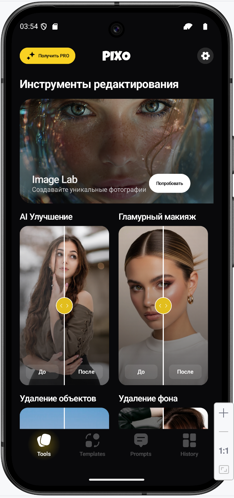 | 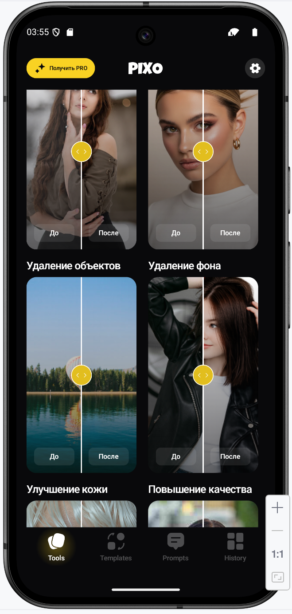 | 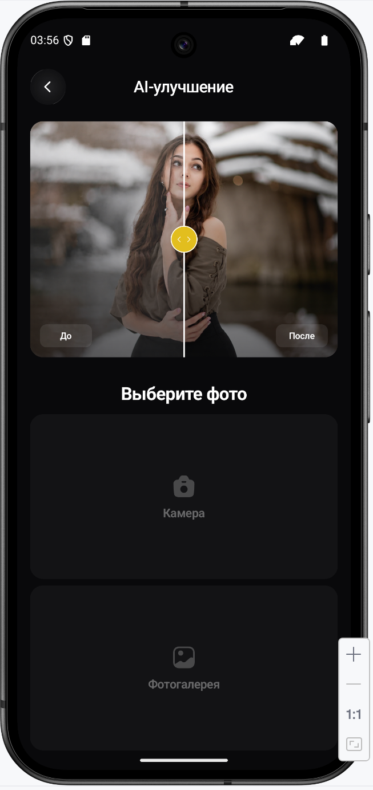 | 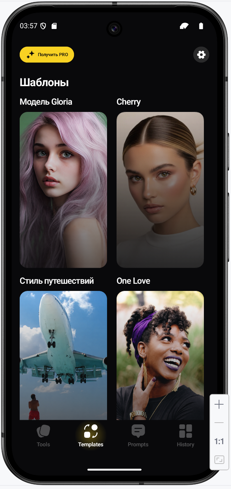 |

| ✍️ Prompt | 🕘 History | ⚙️ Settings | 💳 Paywall |
|---|---|---|---|
| 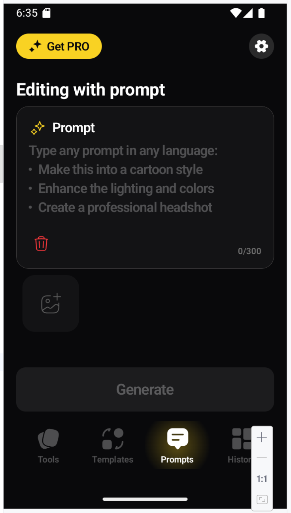 | 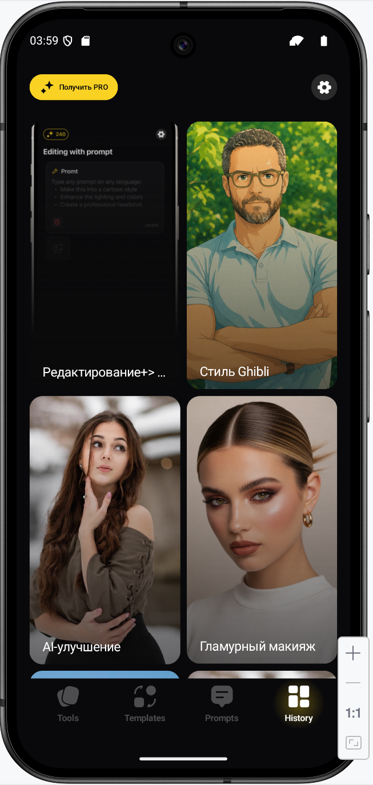 | 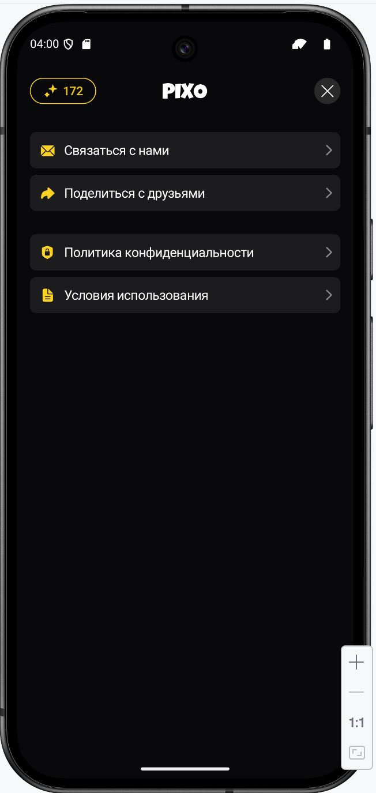 | 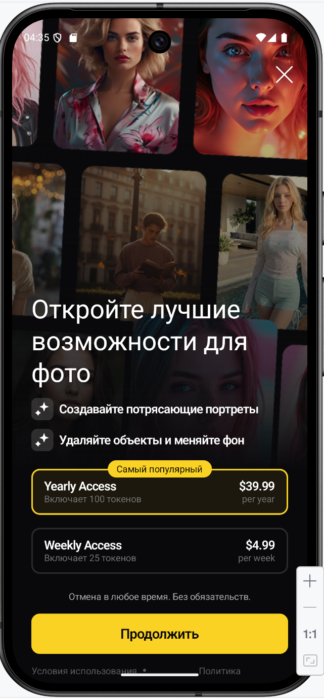 |

| 🪙 Token | 🎬 Onboarding | 🖼 Before/After | ✅ Result |
|---|---|---|---|
| 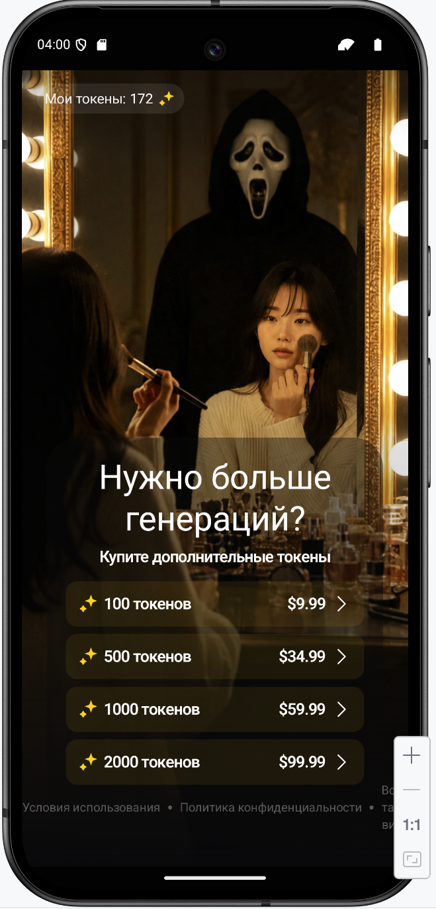 | 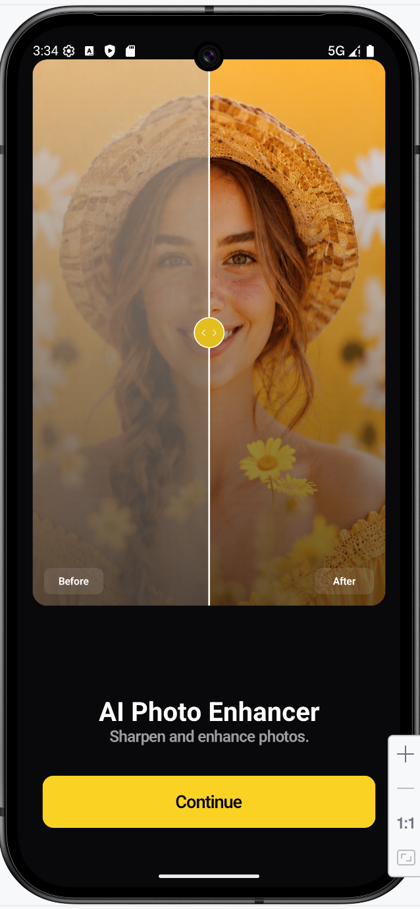 | 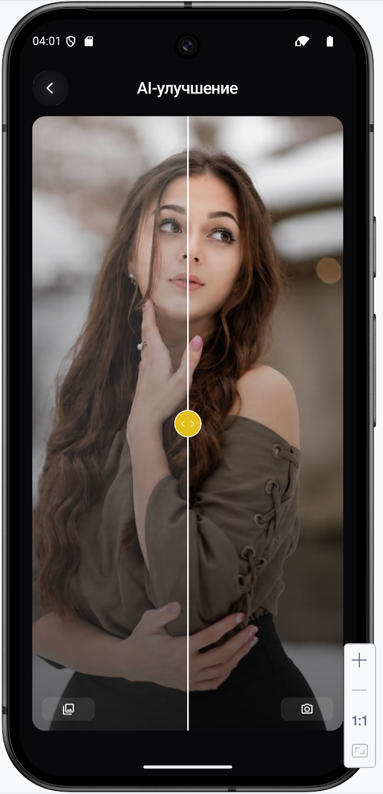 | 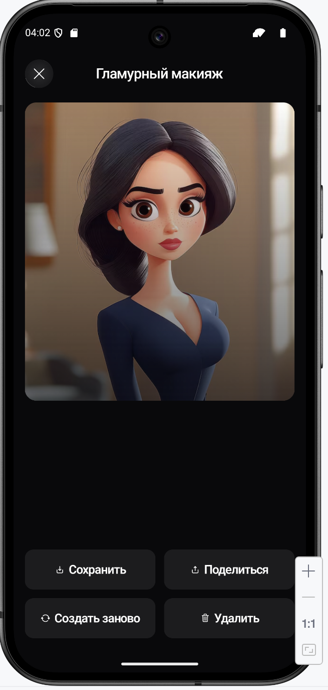 |

---

# 📁 Screenshot Structure

```text
screenshots/
├── banner.png
├── main.png
├── tools_grid.png
├── tool_detail.png
├── templates.png
├── prompt.png
├── history.png
├── settings.png
├── paywall.png
├── token.png
├── onboarding.png
├── before_after.png
└── result.png
```

---

# 🎨 Design Reference

| 🎨 Figma Project   | 📱 Platform | 🧩 Usage              | 🔗 Link                                                                                                     |
| ------------------ | ----------- | --------------------- | ----------------------------------------------------------------------------------------------------------- |
| Banana App Android | Android     | Main visual reference | https://www.figma.com/design/N61vQjYKyxJatKT2Hvx60w/Banana-App-Android?node-id=0-1&p=f&t=EubeNoq1HOa40uqZ-0 |

---

# 🧪 Development Method

| 1️⃣ Step                | 2️⃣ Build        | 3️⃣ Run               | 4️⃣ Check         | 5️⃣ Fix       | 6️⃣ Continue   | 7️⃣ Regression | 8️⃣ Release     |
| ----------------------- | ---------------- | --------------------- | ----------------- | ------------- | -------------- | -------------- | --------------- |
| Implement small feature | Gradle build     | Emulator/device       | Verify scenario   | Resolve issue | Move forward   | Full app pass  | MVP preparation |
| Stable iteration        | No broken builds | UI + logic validation | Real interactions | Stable flow   | 73 steps total | 203+ tasks     | Production MVP  |

---

# 👨‍💻 Developer

| 👤 Name        | 💼 Role           | 📱 Focus      | ⚡ Stack          | 🚀 Product | 🔗 GitHub                    | ⏳ Timeline | ✅ Status  |
| -------------- | ----------------- | ------------- | ---------------- | ---------- | ---------------------------- | ---------- | --------- |
| Amanzhol Aimov | Android Developer | AI Mobile MVP | Kotlin + Compose | PIXO       | https://github.com/amanzhola | 22 days    | Completed |

---

# 🏁 Final Status

| 🚀 MVP            | 🎨 UI              | 🧭 Navigation           | 🎬 Onboarding      | 🧩 Tools    | 🎨 Templates | ✍️ Prompt | 💳 Monetization       |
| ----------------- | ------------------ | ----------------------- | ------------------ | ----------- | ------------ | --------- | --------------------- |
| Completed         | Completed          | Completed               | Completed          | Completed   | Completed    | Completed | Completed             |
| First Android MVP | Dynamic Compose UI | Multi-flow architecture | Premium onboarding | 11 AI flows | 24 templates | Prompt AI | Subscription + tokens |
