# ✍️ PIXO — Prompt Flow

<p align="center">
  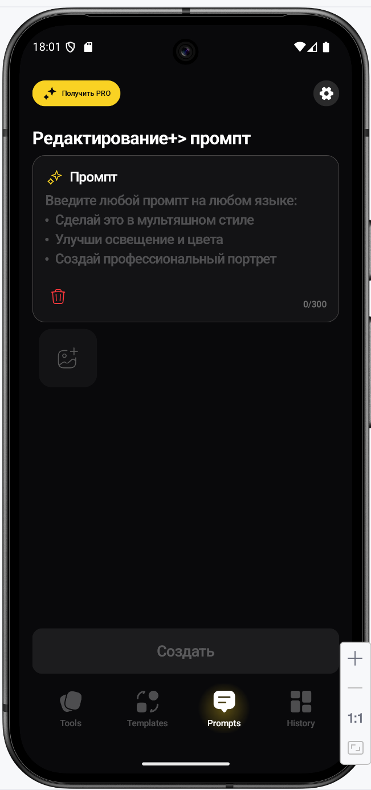
</p>

---

# 🚀 Prompt Flow Overview

| 🎯 Feature   | 📱 Flow Type                | 📸 Source           | 🧠 Logic                   | ✅ Result        |
| ------------ | --------------------------- | ------------------- | -------------------------- | --------------- |
| Prompt Flow  | AI text-to-style generation | Camera / Library    | Prompt-based AI generation | Generated image |
| Premium flow | Separate navigation tab     | Image + text prompt | Interactive generation     | Result screen   |

---

# ✍️ Prompt Flow Screens

| Prompt 1                                        | Prompt 2                                        | Prompt 3                                        | Prompt 4                                        |
| ----------------------------------------------- | ----------------------------------------------- | ----------------------------------------------- | ----------------------------------------------- |
|  | 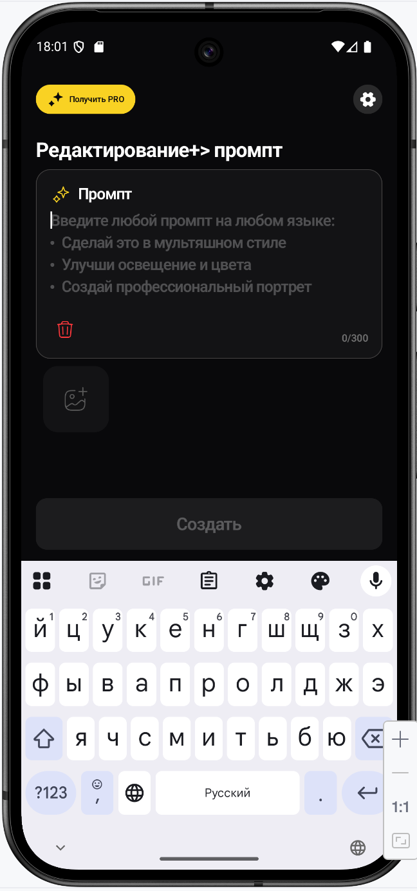 | 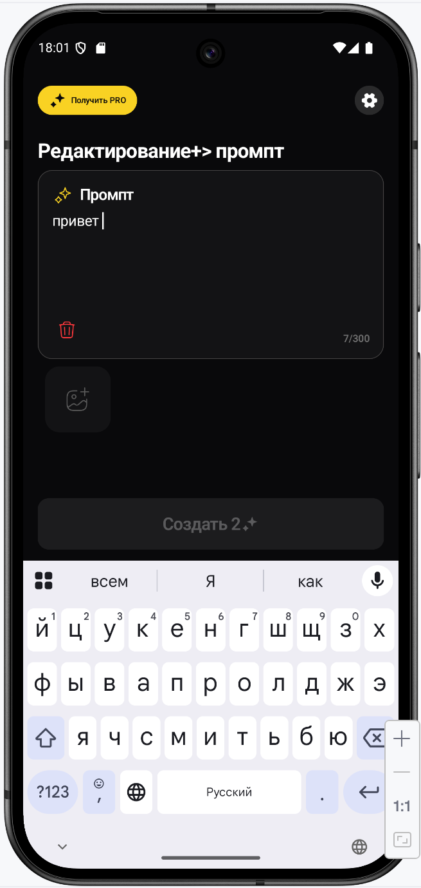 | 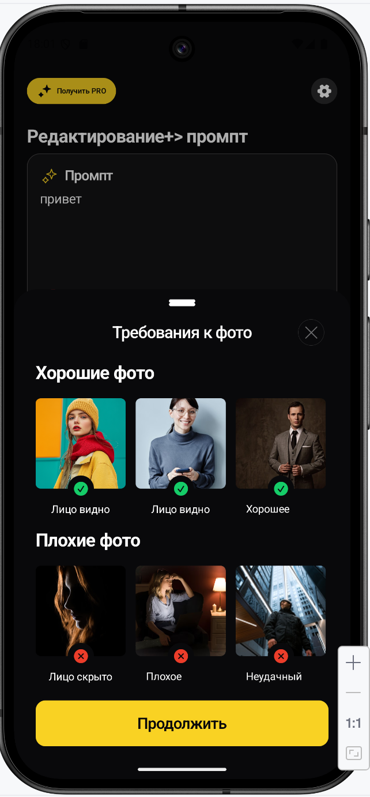 |

| Prompt 5                                        | Prompt 6                                        | Prompt 7                                        | Prompt 8                                        |
| ----------------------------------------------- | ----------------------------------------------- | ----------------------------------------------- | ----------------------------------------------- |
| 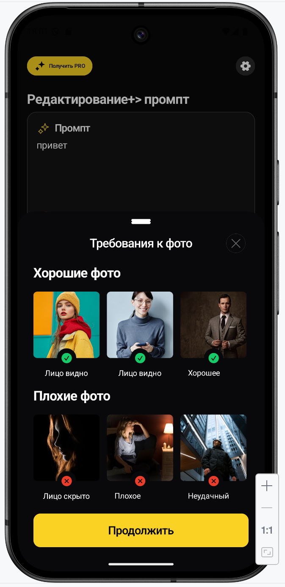 | 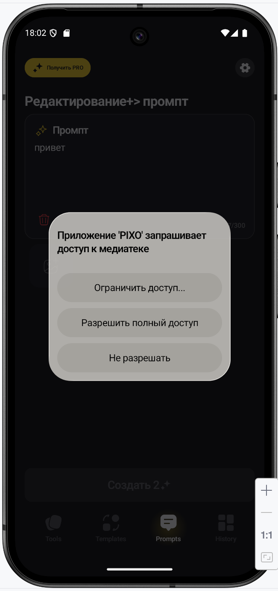 | 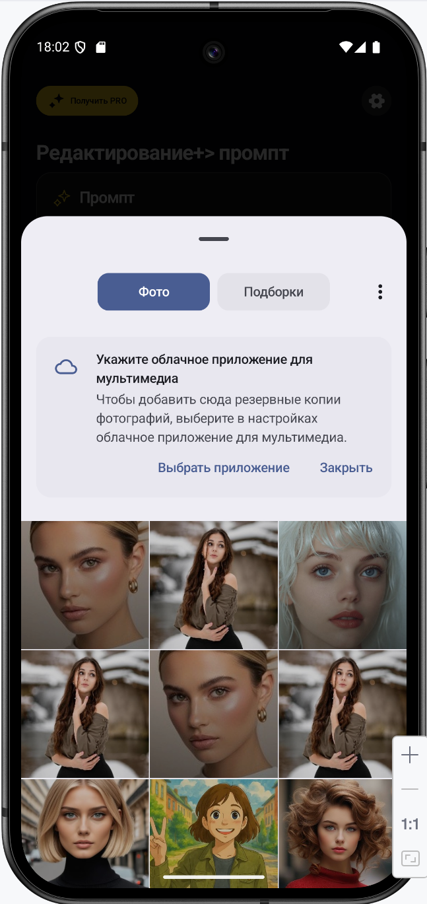 | 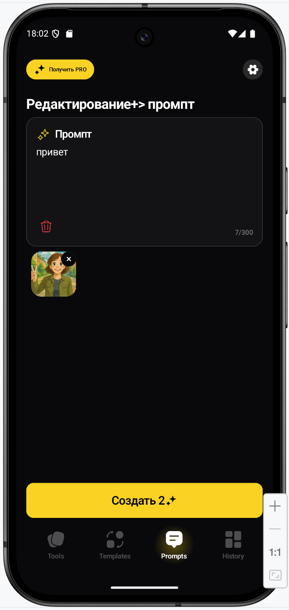 |

| Prompt 9                                        | Prompt 10                                        | Prompt 11                                        | Prompt 12                                        |
| ----------------------------------------------- | ------------------------------------------------ | ------------------------------------------------ | ------------------------------------------------ |
| 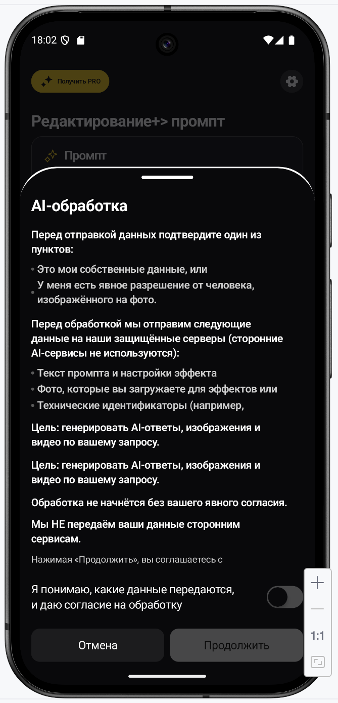 | 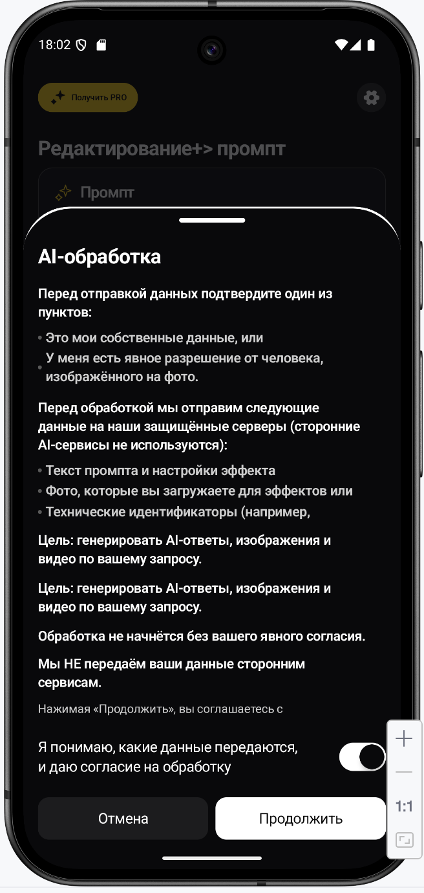 | 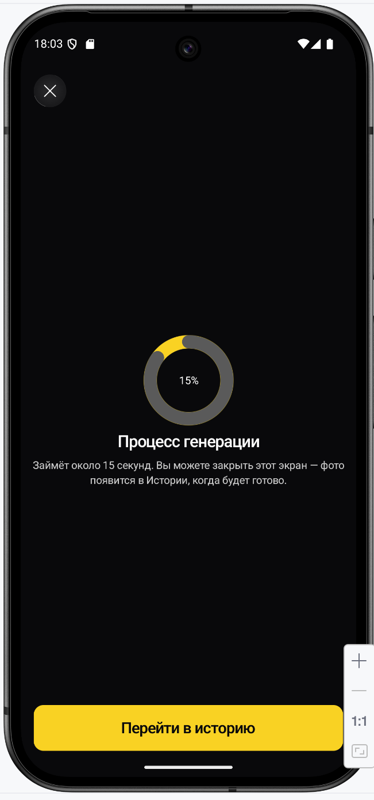 | 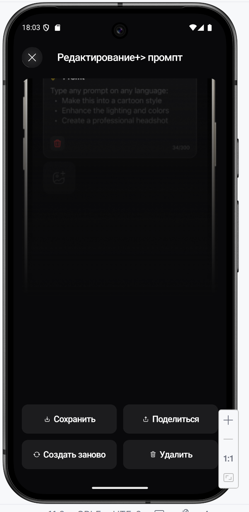 |

| Prompt 13                                        | Prompt 14                                        | Generation                | Result                 |
| ------------------------------------------------ | ------------------------------------------------ | ------------------------- | ---------------------- |
| 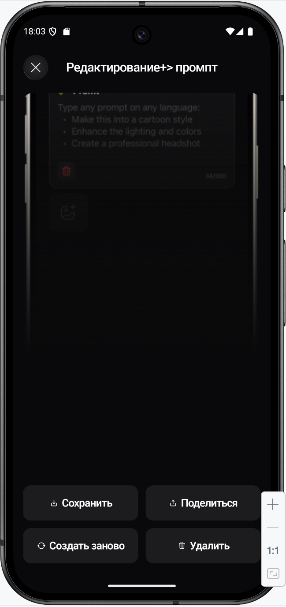 | 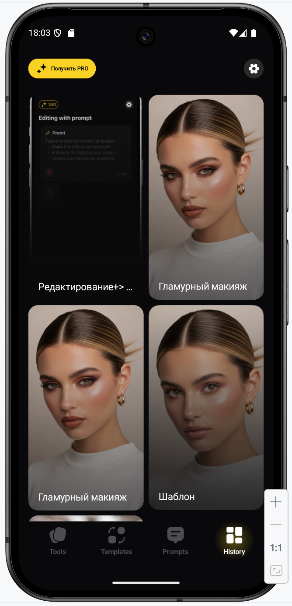 | Interactive AI generation | Generated image result |

---

# 🧠 Prompt Logic

| Step | Action          | Result                 | Validation           |
| ---- | --------------- | ---------------------- | -------------------- |
| 1    | Open Prompt tab | Opens prompt editor    | Premium check        |
| 2    | Enter prompt    | Text validation        | Empty prompt blocked |
| 3    | Select image    | Camera / Library       | Required image       |
| 4    | Generate        | AI generation starts   | Interactive loading  |
| 5    | Result          | Generated styled image | Save/share/history   |

---

# ⚡ Prompt Features

| Prompt Input | AI Generation | Interactive Loading | Result Screen |
| ------------ | ------------- | ------------------- | ------------- |
| Supported    | Supported     | Supported           | Supported     |

| Camera    | Gallery   | Premium Flow | History Support |
| --------- | --------- | ------------ | --------------- |
| Supported | Supported | Supported    | Supported       |

---

# 🔒 Premium Logic

| Action          | Free User                  | Premium User      |
| --------------- | -------------------------- | ----------------- |
| Open Prompt tab | Opens onboarding + paywall | Opens Prompt Flow |
| Generate image  | Blocked                    | Allowed           |
| Save result     | Blocked                    | Allowed           |

---

# 📁 Folder Structure

```text
docs/
 └── prompt_flow/
      ├── README.md
      └── screenshots/
           ├── Prompt1.png
           ├── Prompt2.png
           ├── Prompt3.png
           ├── Prompt4.png
           ├── Prompt5.png
           ├── Prompt6.png
           ├── Prompt7.png
           ├── Prompt8.png
           ├── Prompt9.png
           ├── Prompt10.png
           ├── Prompt11.png
           ├── Prompt12.png
           ├── Prompt13.png
           └── Prompt14.png
```
