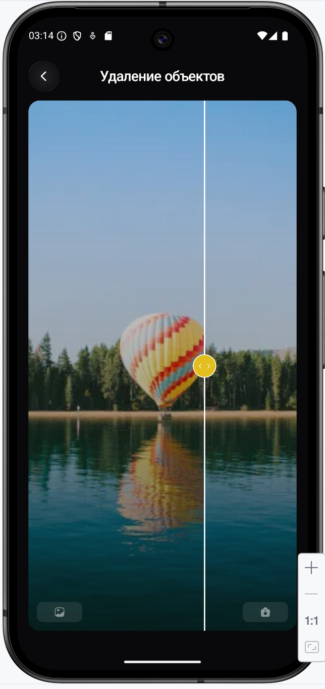

# 🧹 PIXO — Remove Objects Flow

<p align="center">
  
</p>

---

# 🚀 Remove Objects Overview

| 🎯 Tool         | 📱 Flow           | 📸 Sources       | ⚡ Processing            | ✅ Result       |
| --------------- | ----------------- | ---------------- | ----------------------- | -------------- |
| Remove Objects  | AI object removal | Camera + Library | Prompt-based cleanup    | Clean photo    |
| Premium AI tool | Multi-step flow   | Gallery / Camera | Remove selected objects | Natural result |

---

# 🧭 Main Screens

| Tools Screen                                             | Alternative                                           | Templates Screen                                             | Prompts Screen                                             |
| -------------------------------------------------------- | ----------------------------------------------------- | ------------------------------------------------------------ | ---------------------------------------------------------- |
|  |  |  |  |

| History Screen                                             | Settings Screen                                             | Token Screen Variant                                            | Token Screen                                             |
| ---------------------------------------------------------- | ----------------------------------------------------------- | --------------------------------------------------------------- | -------------------------------------------------------- |
|  |  |  |  |

---

# 📸 Camera Flow

| Step 1                                                                         | Step 2                                                                  | Step 3                                                                 | Step 4                                                                  |
| ------------------------------------------------------------------------------ | ----------------------------------------------------------------------- | ---------------------------------------------------------------------- | ----------------------------------------------------------------------- |
|  |  |  |  |

| Step 5                                                                | Step 6                                                                         | Step 7                                                       | Step 8                                                                              |
| --------------------------------------------------------------------- | ------------------------------------------------------------------------------ | ------------------------------------------------------------ | ----------------------------------------------------------------------------------- |
|  |  |  |  |

| Step 9                                                                            | Step 10                                                                             | Step 11                                                                             | Step 12                                                                                                  |
| --------------------------------------------------------------------------------- | ----------------------------------------------------------------------------------- | ----------------------------------------------------------------------------------- | -------------------------------------------------------------------------------------------------------- |
|  |  |  |  |

| Step 13                                                                                     | Step 14                                                                     | Step 15                                                                 |
| ------------------------------------------------------------------------------------------- | --------------------------------------------------------------------------- | ----------------------------------------------------------------------- |
|  |  |  |

---

# 🖼 Library Flow

| Library 1                                                                      | Library 2                                                               | Library 3                                                                                     | Library 4                                                                         |
| ------------------------------------------------------------------------------ | ----------------------------------------------------------------------- | --------------------------------------------------------------------------------------------- | --------------------------------------------------------------------------------- |
|  |  |  |  |

| Library 5                                                                         | Library 6                                                                        | Library 7                                                                          | Library 8                                                                         |
| --------------------------------------------------------------------------------- | -------------------------------------------------------------------------------- | ---------------------------------------------------------------------------------- | --------------------------------------------------------------------------------- |
|  |  |  |  |

| Library 9                                                                                               | Library 10                                                                                  | Library 11                                                                   | Library 12                                                               |
| ------------------------------------------------------------------------------------------------------- | ------------------------------------------------------------------------------------------- | ---------------------------------------------------------------------------- | ------------------------------------------------------------------------ |
|  |  |  |  |

---

# ⚡ Remove Objects Logic

| 📸 Input      | ✍️ Prompt          | 🧠 AI Process          | ✅ Output             |
| ------------- | ------------------ | ---------------------- | -------------------- |
| Camera photo  | Object description | Remove selected object | Natural clean result |
| Gallery photo | Object description | Remove selected object | Natural clean result |

---

# 🧩 Features

| Camera Flow | Library Flow | Prompt Input | AI Generation | Result Screen | History     |
| ----------- | ------------ | ------------ | ------------- | ------------- | ----------- |
| ✅ Supported | ✅ Supported  | ✅ Supported  | ✅ Supported   | ✅ Supported   | ✅ Supported |

---

# 📁 Folder Structure

```text
docs/
 └── remove_objects/
      ├── README.md
      └── screenshots/
           ├── 1_Tools Screen.png
           ├── 2_Alternative.png
           ├── 2_Templates Screen.png
           ├── 3_Prompts Screen.png
           ├── 4_History Screen.png
           ├── 5_Settings Screen.png
           ├── 6_Token Screen(x).png
           ├── 6_Token Screen.png
           ├── camera_flow/
           │    ├── 1_Remove Objects Card2.png
           │    ├── 2_Remove Objects2.png
           │    ├── 3_Remove Objects.png
           │    ├── 4_Remove Objects1.png
           │    ├── 5_Camera Dialog.png
           │    ├── 6_Camera Android Alert.png
           │    ├── 7_Camera.png
           │    ├── 8_Edit Screen (Camera)2.png
           │    ├── 9_Edit Screen(Passive)2.png
           │    ├── 10_Edit Screen(Entering)2.png
           │    ├── 11_Edit Screen (Camera).png
           │    ├── 12_Generation Alert Button Sheet(Passive)2.png
           │    ├── 13_Generation Alert Bottom Sheet2.png
           │    ├── 14_Generation Screen1.png
           │    └── 15_Result Screen1.png
           └── library_flow/
                ├── 1_Remove Objects Card.png
                ├── 2_Library Dialog.png
                ├── 3_Libary Bottom Sheet Requirements.png
                ├── 4_Local Library Choosing.png
                ├── 5_Edit Screen(Passive).png
                ├── 6_Edit Screen(Typing).png
                ├── 7_Edit Screen(Entering).png
                ├── 8_Edit Screen(Library).png
                ├── 9_Generation Alert Button Sheet(Passive).png
                ├── 10_Generation Alert Botton Sheet.png
                ├── 11_Generation Screen2.png
                └── 12_Reulst Screen2.png
```
