# 😄 PIXO — Smile Edit Flow

<p align="center">
  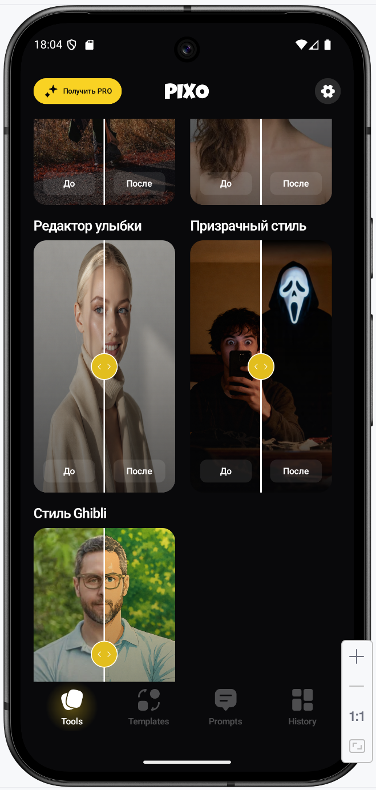
</p>

---

# 🚀 Smile Edit Overview

| 🎯 Tool         | 📱 Flow Type              | 📸 Source           | 🧠 Logic               | ✅ Result        |
| --------------- | ------------------------- | ------------------- | ---------------------- | --------------- |
| Smile Edit      | AI face expression editor | Camera / Photo flow | Smile enhancement      | Edited portrait |
| Premium AI tool | Multi-step generation     | Image based         | Interactive processing | Result screen   |

---

# 📸 Smile Edit Flow

| Step 1                                              | Step 2                                              | Step 2-1                                              | Step 3                                              |
| --------------------------------------------------- | --------------------------------------------------- | ----------------------------------------------------- | --------------------------------------------------- |
|  | 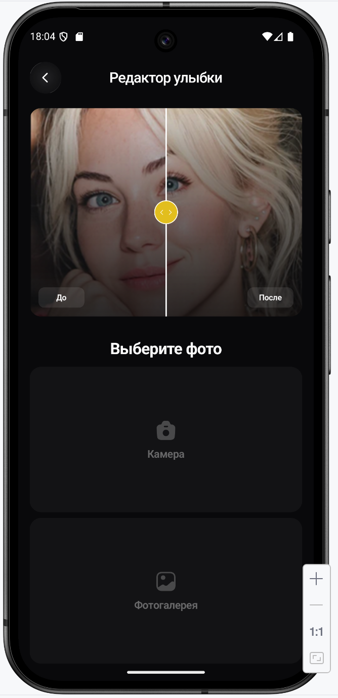 | 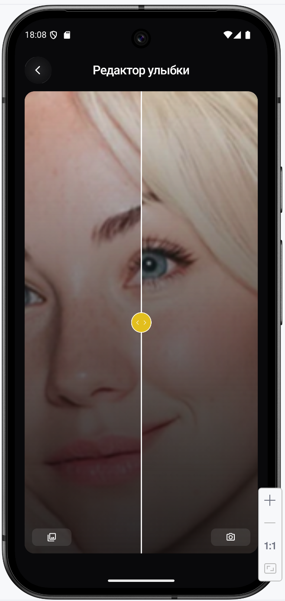 | 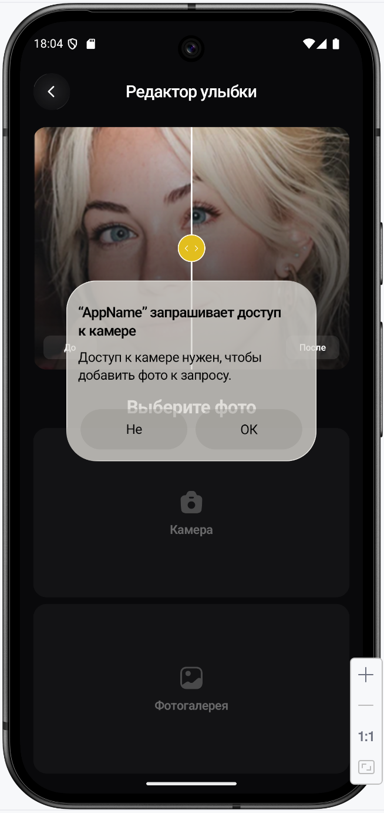 |

| Step 4                                              | Step 4-1                                              | Step 4-2                                              | Step 4-3                                              |
| --------------------------------------------------- | ----------------------------------------------------- | ----------------------------------------------------- | ----------------------------------------------------- |
| 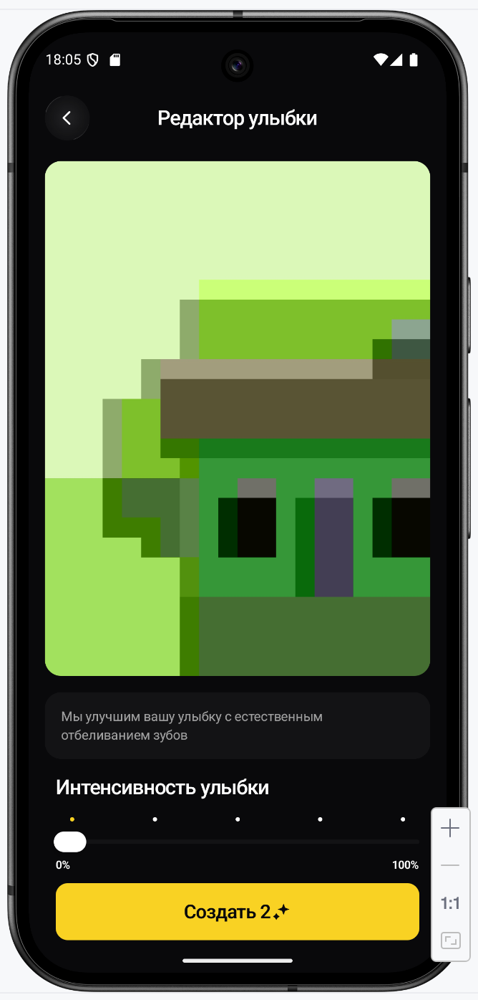 | 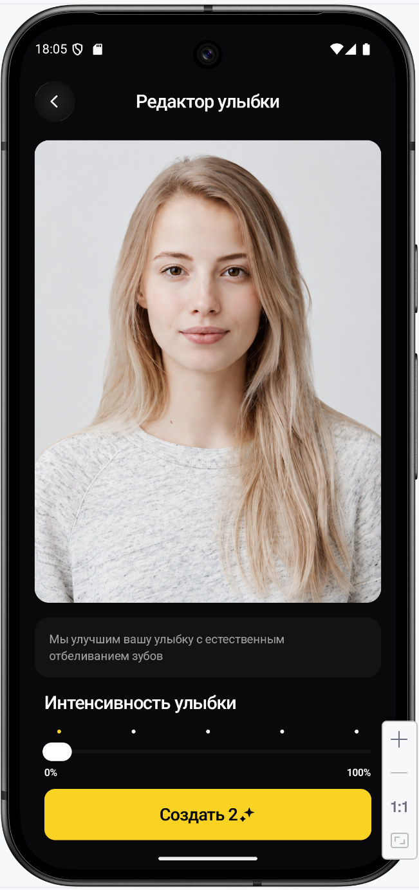 | 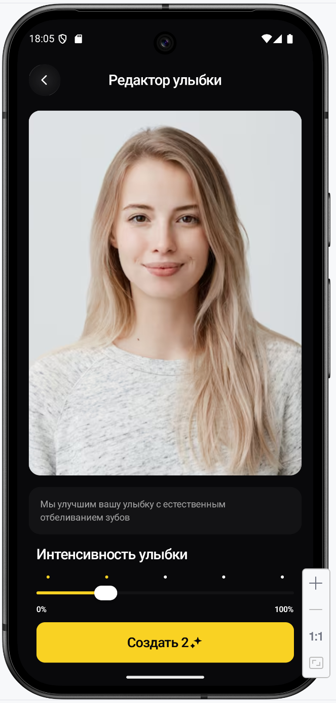 | 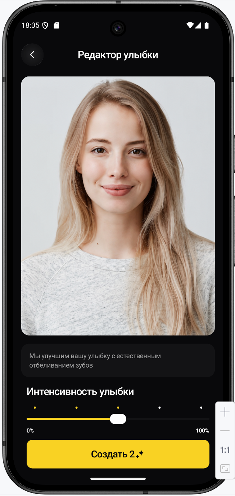 |

| Step 4-4                                              | Step 4-5                                              | Step 5                                              | Step 6                                              |
| ----------------------------------------------------- | ----------------------------------------------------- | --------------------------------------------------- | --------------------------------------------------- |
| 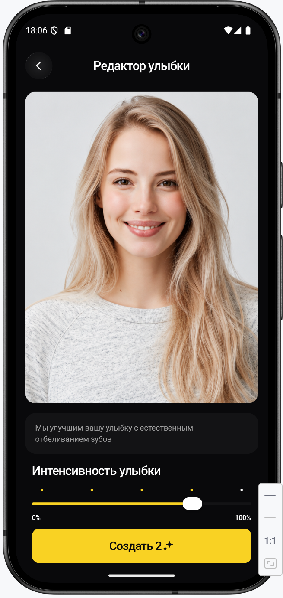 | 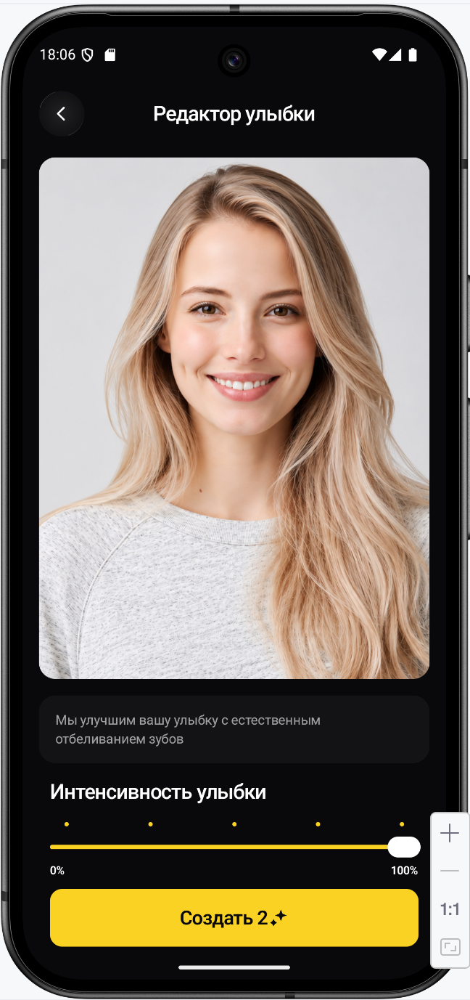 | 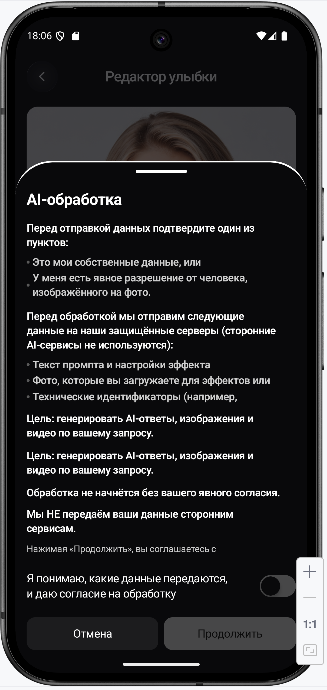 | 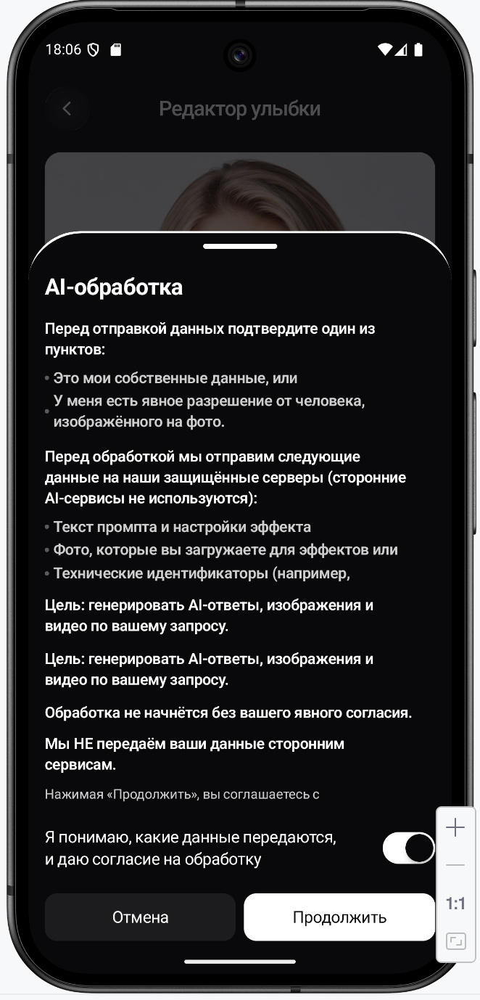 |

| Step 7                                              | Processing             | Result              | Premium            |
| --------------------------------------------------- | ---------------------- | ------------------- | ------------------ |
| 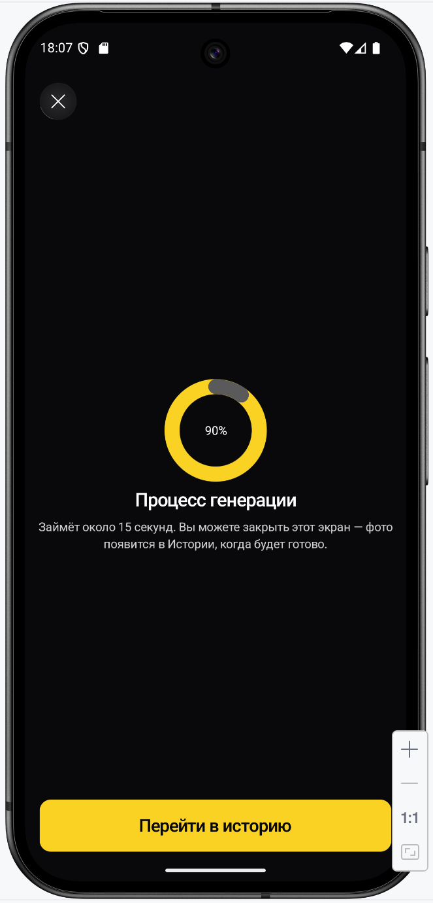 | Interactive generation | Edited smile result | Premium gated flow |

---

# 🧠 Smile Edit Logic

| 📸 Input       | 😄 AI Action         | ⏳ Loading              | ✅ Output           |
| -------------- | -------------------- | ---------------------- | ------------------ |
| Portrait photo | Smile transformation | Interactive generation | Updated expression |
| Selected image | Face edit pipeline   | Processing state       | Result screen      |

---

# 🧩 Features

| Image Source | Face Edit | Interactive Flow | Result Screen |
| ------------ | --------- | ---------------- | ------------- |
| Supported    | Supported | Supported        | Supported     |

---

# 📁 Folder Structure

```text
docs/
 └── smile_edit/
      ├── README.md
      └── screenshots/
           ├── SMILE_EDIT1.png
           ├── SMILE_EDIT2.png
           ├── SMILE_EDIT2-1.png
           ├── SMILE_EDIT3.png
           ├── SMILE_EDIT4.png
           ├── SMILE_EDIT4-1.png
           ├── SMILE_EDIT4-2.png
           ├── SMILE_EDIT4-3.png
           ├── SMILE_EDIT4-4.png
           ├── SMILE_EDIT4-5.png
           ├── SMILE_EDIT5.png
           ├── SMILE_EDIT6.png
           └── SMILE_EDIT7.png
```
