\# 🎨 PIXO — Templates Flow


<p align="center">

&#x20; 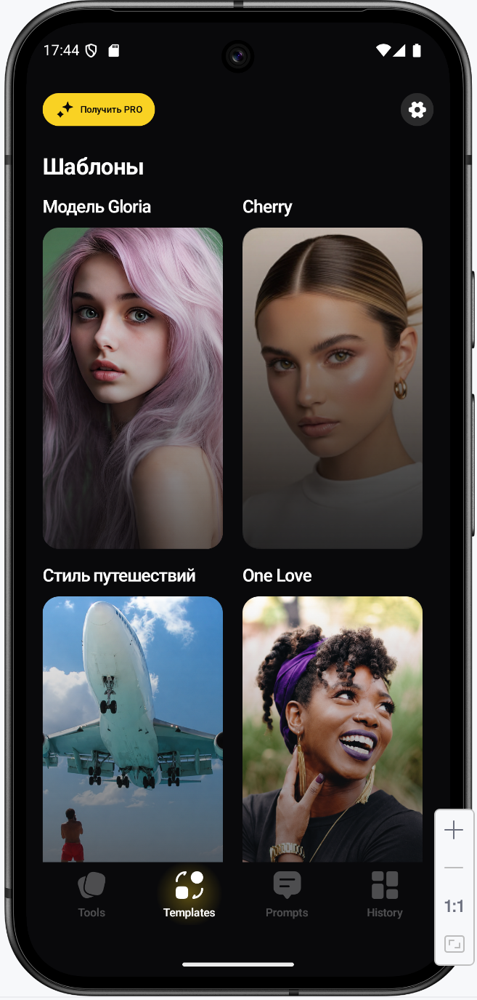

</p>


\---


\# 🚀 Templates Overview


| 🎯 Feature   | 📱 Flow Type              | 🎨 Cards    | 📸 Source        | ✅ Result               |

| ------------ | ------------------------- | ----------- | ---------------- | ---------------------- |

| Templates    | AI template generation    | 24 cards    | Camera / Library | Generated styled photo |

| Premium flow | Separate Templates screen | Grid system | Selected photo   | Result screen          |


\---


\# 🎨 Template Selection Flow


| Templates 1                                        | Template 2                                        | Template 3                                        | Template 4                                        |

| -------------------------------------------------- | ------------------------------------------------- | ------------------------------------------------- | ------------------------------------------------- |

|  | 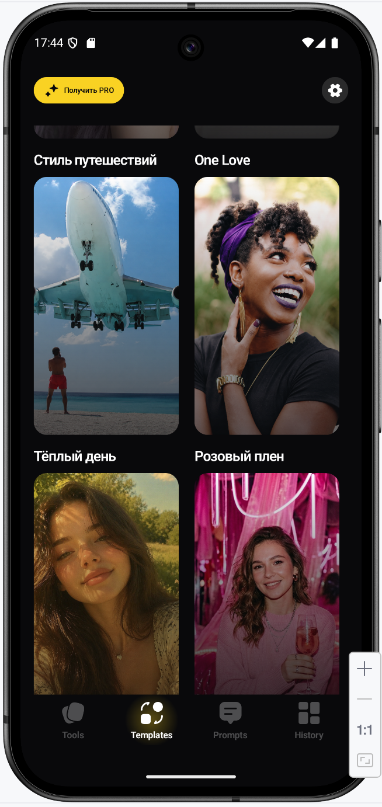 | 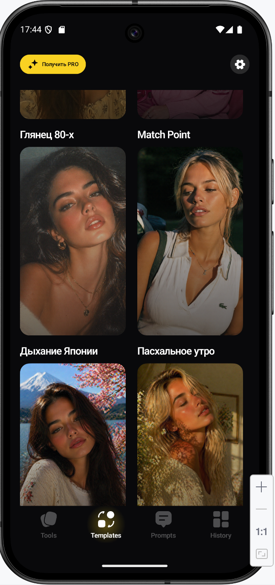 | 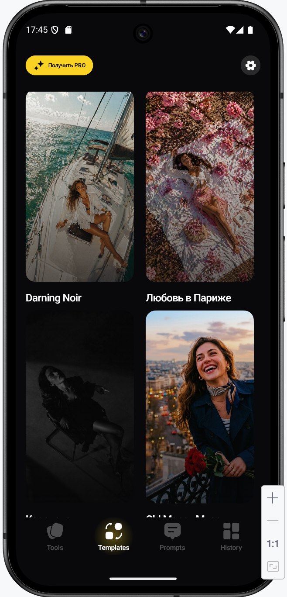 |


| Template 5                                        | Template 6                                        | Templates 7                                        | Templates 8                                        |

| ------------------------------------------------- | ------------------------------------------------- | -------------------------------------------------- | -------------------------------------------------- |

| 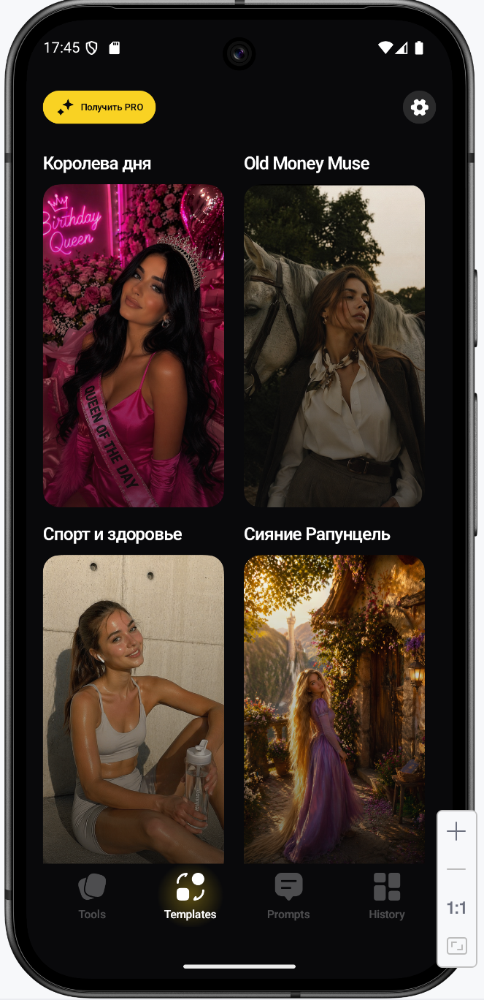 | 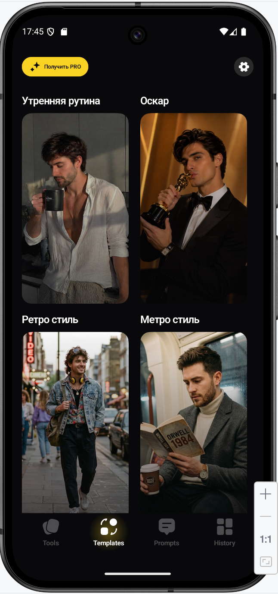 | 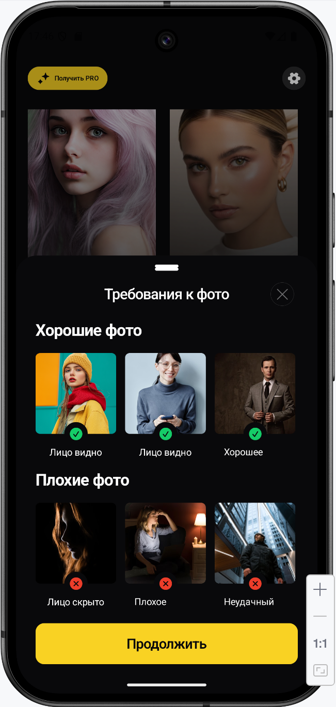 | 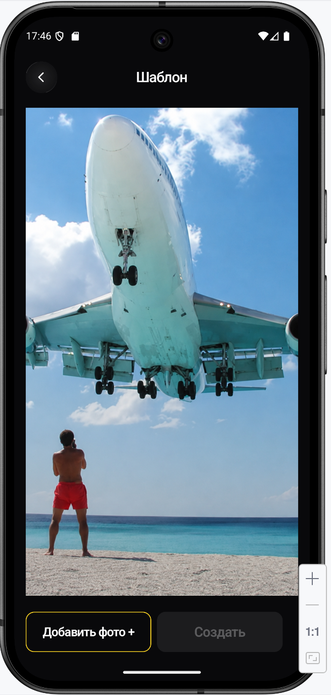 |


| Templates 9                                        | Templates 10                                        | Templates 11                                        | Templates 12                                        |

| -------------------------------------------------- | --------------------------------------------------- | --------------------------------------------------- | --------------------------------------------------- |

| 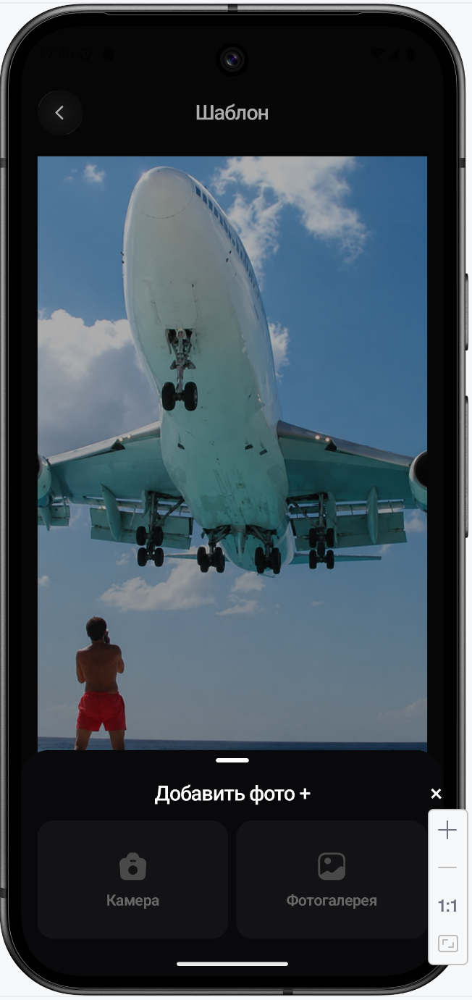 | 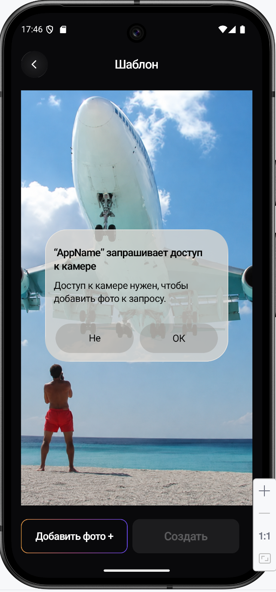 | 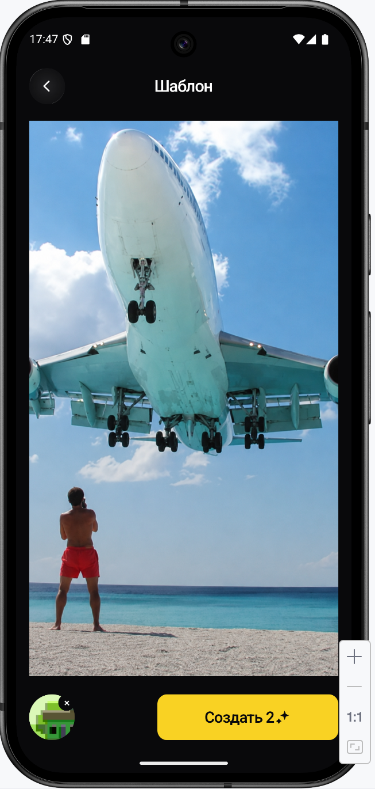 | 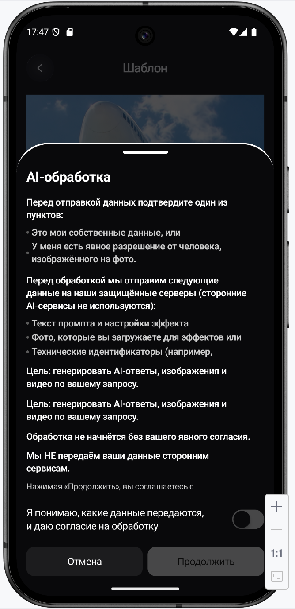 |


| Templates 13                                        | Templates 14                                        | Templates 15                                        | Templates 16                                        |

| --------------------------------------------------- | --------------------------------------------------- | --------------------------------------------------- | --------------------------------------------------- |

| 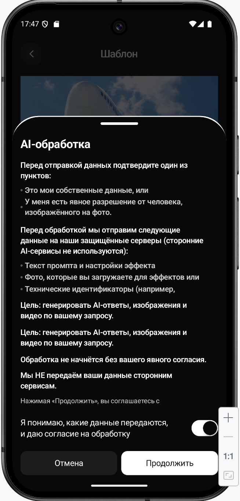 | 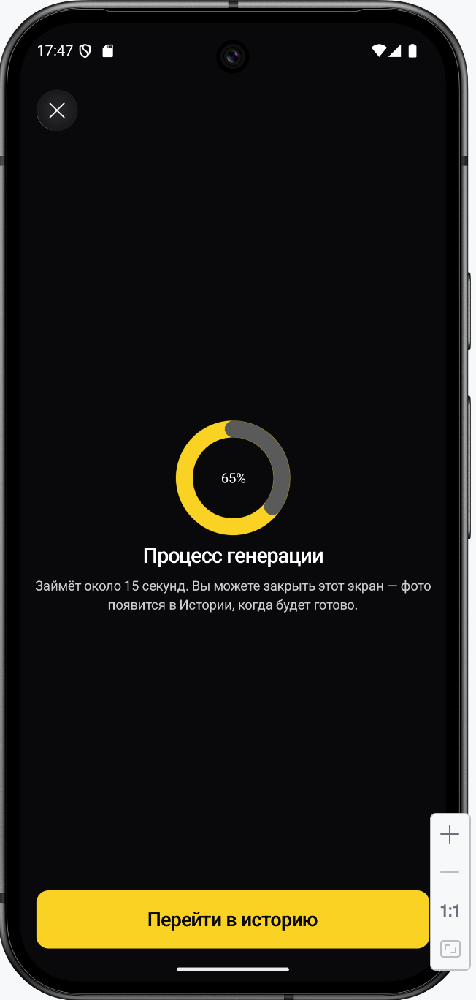 | 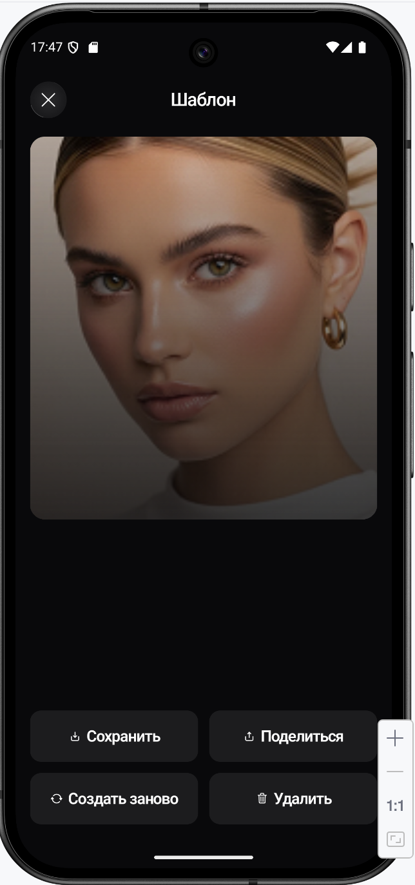 | 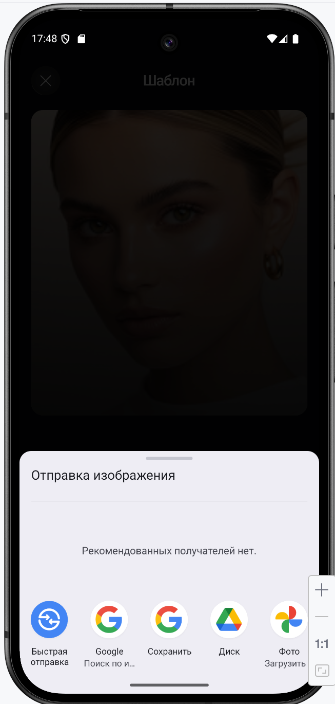 |


| Templates 17                                        | Templates 18                                        | Flow                          | Result        |

| --------------------------------------------------- | --------------------------------------------------- | ----------------------------- | ------------- |

| 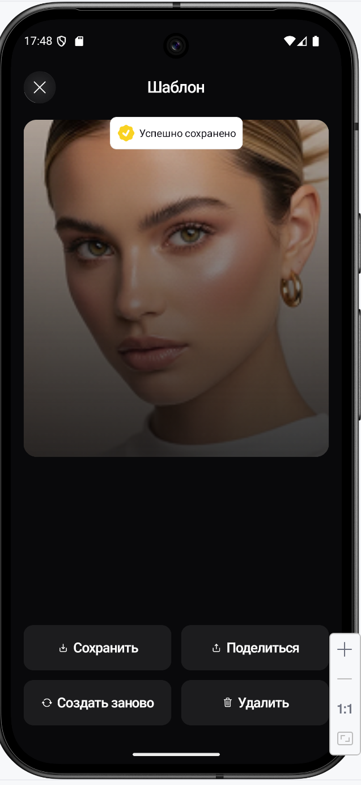 | 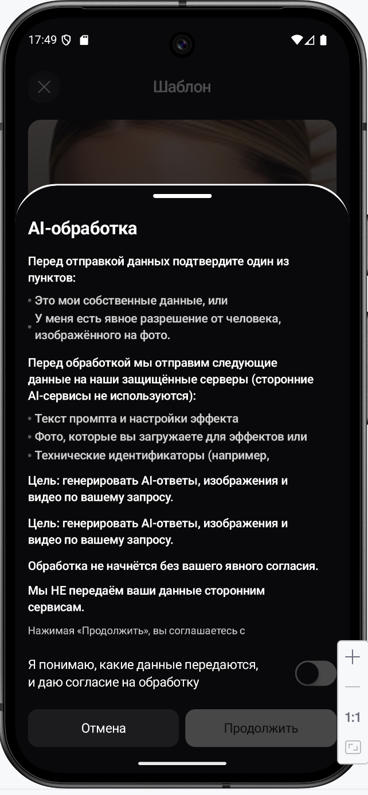 | Template → Photo → Generation | Styled result |


\---


\# 🧩 Templates Logic


| Step | Action             | Result                         | Premium Logic                          |

| ---- | ------------------ | ------------------------------ | -------------------------------------- |

| 1    | Open Templates tab | Shows 24 template cards        | Free user sees onboarding/paywall flow |

| 2    | Select template    | Opens photo source flow        | Premium required                       |

| 3    | Choose image       | Opens template generation flow | Camera / Library                       |

| 4    | Generate           | Opens result screen            | AI styled output                       |


\---


\# 🎨 Template Cards


| Gloria Model    | Cherry         | Travel Style     | One Love       |

| --------------- | -------------- | ---------------- | -------------- |

| Warm Day        | Pink Captivity | 80s Gloss        | Match Point    |

| Japan Breathe   | Easter Morning | Sea Breathe      | Blossom        |

| Darning Noir    | Love in Paris  | Queen of the Day | Old Money Muse |

| Sport \& Healthy | Rapunzel Glow  | Safari           | Housewives     |

| Morning Routine | Oscar          | Retro Style      | Metro Style    |


\---


\# 📁 Folder Structure


```text

docs/

&#x20;└── templates/

&#x20;     ├── README.md

&#x20;     └── screenshots/

&#x20;          ├── Templates1.png

&#x20;          ├── Template2.png

&#x20;          ├── Template3.png

&#x20;          ├── Template4.png

&#x20;          ├── Template5.png

&#x20;          ├── Template6.png

&#x20;          ├── Templates7.png

&#x20;          ├── Templates8.png

&#x20;          ├── Templates9.png

&#x20;          ├── Templates10.png

&#x20;          ├── Templates11.png

&#x20;          ├── Templates12.png

&#x20;          ├── Templates13.png

&#x20;          ├── Templates14.png

&#x20;          ├── Templates15.png

&#x20;          ├── Templates16.png

&#x20;          ├── Templates17.png

&#x20;          └── Templates18.png

```


